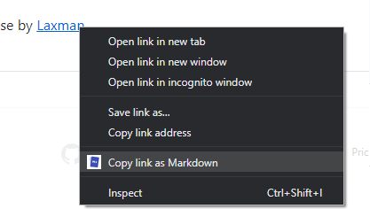

#  Copy as Markdown

[link-amo]: https://addons.mozilla.org/en-US/firefox/addon/cpy-as-md/

> Browser extension to copy hyperlinks, images, and selected text as Markdown



## Install

- [**Firefox** add-on.][link-amo] [][link-amo]
- **Chrome** extension not published yet.

## Features

- Ability to copy links, images, and selected text as Markdown.
- Linked images, will have options to individually select link or images.

When copying links and images, Chrome doesn't ley you extract images alt text or anchors text content to be used in Markdown, instead the links themselves are used as link content. Firefox doesn't have this limitation though.

``` md
<a href="https://github.com/notlmn">Laxman</a>
                  ⬇
[Laxman](https://github.com/notlmn)
```

``` md

                          ⬇

```

## License

MIT
