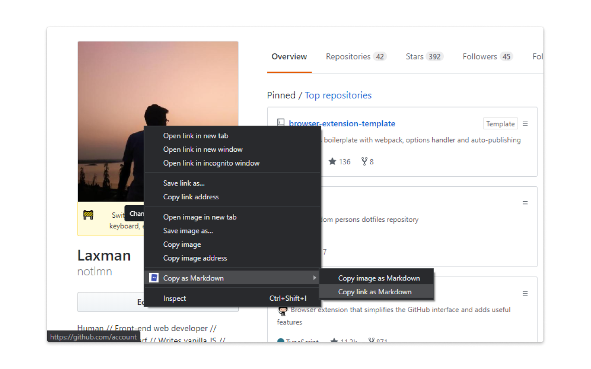

#  Copy as Markdown

> Browser extension to copy hyperlinks, images, and selected text as Markdown

Inspired from [this tweet](https://twitter.com/NicoloRibaudo/status/1143521181196345346) by [@nicolo-ribaudo](https://github.com/nicolo-ribaudo).

## Install

- [**Chrome** extension][link-cws] [][link-cws]
- [**Firefox** add-on][link-amo] [][link-amo]

## Screenshot

## Features

The user has access to three actions provided in the context menus with support to handle the following text styles.

- **Formatted Text**: _Italic_, **bold**, ~~strikethrough~~, and `inline code`.
- **Unordered and Ordered Lists**: With [task lists](https://github.github.com/gfm/#task-list-items-extension-) support.
- **Tables**: A [GFM extension](https://github.github.com/gfm/#tables-extension-).
- **Fenced code blocks**: And language detection using [info strings](https://github.github.com/gfm/#example-112).
- **Links and Images**
  - `<a href="https://github.com/notlmn">Laxman</a>` → `[Laxman](https://github.com/notlmn)`
  - `` → ``

  > **Note:** When copying links and images, Chrome doesn’t let you extract images `alt` text or text content of anchor nodes to be used in Markdown, instead the links themselves are used as link content. Firefox doesn’t have this limitation.

### Permissions

The extension requires the following permission from you for working.

1. `contextMenus`: to show option when right-clicking.
1. `activeTab`: to be able to access content on page.
1. `clipboardWrite`: to be able to write data to clipboard (we still can’t read from your clipboard).

## License

[MIT](license)

[link-amo]: https://addons.mozilla.org/en-US/firefox/addon/cpy-as-md/
[link-cws]: https://chrome.google.com/webstore/detail/copy-as-markdown/nlaionblcaejecbkcillglodmmfhjhfi/
